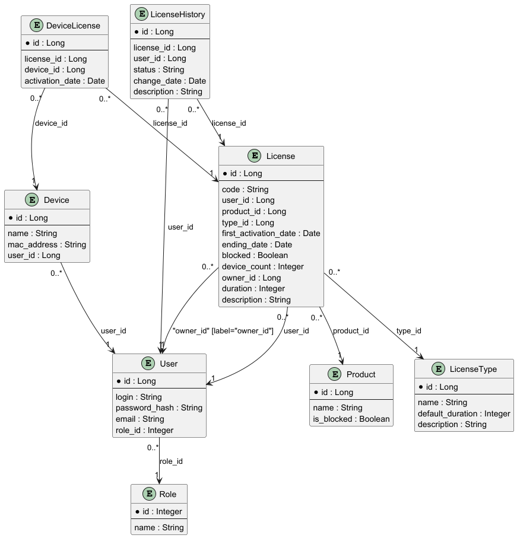
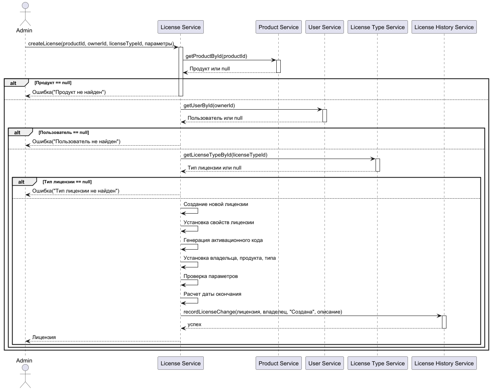
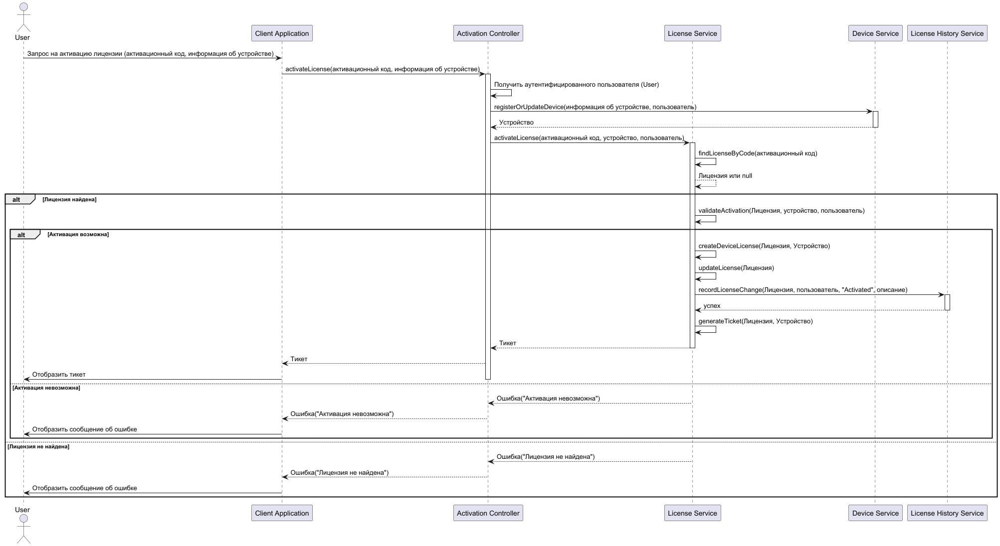
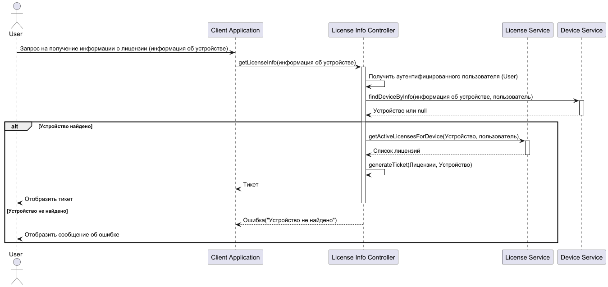

# Цель работы
Создание серверной части для антивирусной системы, которая должна реализовать функционал:
1. Аутентификация и авторизация пользователей;
2. Управление информацией о лицензиях на ПО;
3. Хранение антивирусных баз.

# РБПО

## Задание 1
1. Создать Java проект с фреймворком Spring Boot версии 3.3.x;
2. Опубликовать его на Github;
3. (*) Создать простые контроллеры, чтобы посмотреть, как с ними можно работать.

## Задание 2
1. Подключить к проекту базу данных (PostgreSQL/MySQL);
2. Создать сущности пользователя и лицензии, создав между ними связь Один Ко Многим;
3. Реализовать контроллеры для управления пользователями и лицензиями.

## Задание 3
1. Реализовать недостающие методы в классе `JwtTokenProvider`;
2. Реализовать недостающий метод в классе `JwtTokenFilter`;
3. Реализовать возможность получения токенов.

## Задание 4
1. Расширить таблицу лицензий, добавив:
   - Дату активации лицензии
   - Дату истечения лицензии
   - Флаг блокировки лицензии
   - Строковый идентификатор устройства
2. Добавить таблицу `Products`, в которой определить 2 свойства: название и флаг блокировки;
3. Реализовать возможность регистрации пользователей;
4. Создать класс `Ticket` для передачи информации о лицензии клиентам. Тикет должен состоять из:
   - Текущей даты сервера
   - Времени жизни тикета
   - Даты активации лицензии
   - Даты истечения лицензии
   - Идентификатора пользователя
   - Идентификатора устройства
   - Флага блокировки лицензии
   - Цифровой подписи

## Задание 5  
Реализовать в коде следующую структуру таблиц

## Задание 6
Реализовать логику работы подсистемы лицензирования. Схемы основных процессов показаны ниже.  

## Диаграмма создания лицензии

## Диаграмма активации лицензии

## Диаграмма проверки лицензии

## Диаграмма обновления лицензии

## Задание 7
Завершить WEB-сервис. Подготовить проект к демонстрации  
Проверить работоспособность функционала:
* Добавление пользователей;
* Аутентификация на основе JWT токенов;
* Поддержка CRUD операций для всех сущностей сервиса;
* Работа подсистемы лицензирования;

# ЗИОВПО

## Задание 8
1. Сгенерировать цепочку сертификатов минимум с тремя звеньями;
2. Переключить свой сервис на работу с TLS;
3. Добавить сертификат в доверенные, чтобы браузер нормально с ним работал.

## Задание 9
1. Модифицировать классы, работающие с JWT, добавив возможность работы с Access/Refresh токенами;
2. Для каждой активное сесии выдавать пару одноразовых Access/Refresh токенов, при повторном использовании Refresh токена блокировать все сесиии;
3. Создать таблицу для хранения информации о токенах и сессиях (Структура будет добавлена позже);
4. Реализовать оптимистическую блокировку для доступа к таблице сессий и её обработку в коде.  
[Полное задание](./Access&Refresh_Токены.docx)

## Задание 10
1. Создать таблицу для работы с сигнатурами;
2. Создать таблицы для работы с аудитом;
3. Реализовать механизмы сохранения и получения сигнатур;
4. Реализовать API для доступа к записям;
5. Реализовать механизмы ведения версий сигнатур и аудита;
6. Реализовать выполнение задачи проверки подписи сигнатуры по расписанию. (пока задавать время константой)
7. Добавить оптимистическую блокировку к таблице сигнатур*  
[Полное задание](./Сигнатуры_SpringBoot.docx)

## Задание 11
1. Создать эндпоинт для получения файлов сигнатур и манифеста в формате multipart/mixed;
2. Файл манифеста должен содержать следующие данные:  
   2.1. Целое число - количество строк сигнатур, которые будут переданы в данных;  
   2.2. Массив данных в формате GUID:digital_signature каждой передаваемой сигнатуры;  
   2.3. ЭЦП манифеста, основанное на пунктах 2.1 и 2.2.  
3. Файл данных должен содержать записи сигнатур из БД в бинарном формате, за исключением поля status.;
4. ВНИМАТЕЛЬНО следите за порядком и форматом записи байт на стороне сервера, т.к. на стророне клиента формат и порядок должен быть СТРОГО такой же;  

# Полезные ссылки

1. **Быстрый старт с Spring**  
   [Quickstart — Spring](https://spring.io/quickstart)  
   Краткое руководство по началу работы с фреймворком Spring. Обзор того, как настроить проект с использованием Spring Boot и начать работу.

2. **Создание RESTful сервиса на Spring Boot**  
   [Building a RESTful Web Service — Spring Guide](https://spring.io/guides/gs/rest-service)  
   Подробное руководство по созданию RESTful сервиса с использованием Spring Boot. Описание шагов от создания проекта до разработки REST API, включая обработку HTTP-запросов.

3. **Работа с базой данных с использованием Spring Data JPA**  
   [Spring Boot: Accessing Data with JPA, Hibernate, and PostgreSQL — Medium](https://medium.com/analytics-vidhya/spring-boot-accessing-data-with-jpa-hibernate-and-postgresql-af68386363a4)  
   Статья о подключении к базе данных PostgreSQL с использованием Spring Data JPA и Hibernate. Описаны шаги по конфигурированию доступа к базе данных и реализации CRUD операций.

4. **Добавление базы данных к RESTful сервису на Spring Boot**  
   [Добавляем БД к RESTful сервису на Spring Boot (часть 1) — JavaRush](https://javarush.com/groups/posts/2579-dobavljaem-bd-k-restful-servisu-na-spring-boot-chastjh-1)  
   Руководство по интеграции базы данных в RESTful сервис на Spring Boot. Рассматриваются основные шаги по настройке базы данных и подключению к RESTful API.

5. **Построение RESTful сервисов: расширенное руководство**  
   [Spring REST Tutorial — Spring Guide](https://spring.io/guides/tutorials/rest)  
   Расширенное руководство по созданию RESTful сервисов с использованием Spring. Описание сложных аспектов создания REST API, включая обработку ошибок и расширенную настройку.

6. **Начало работы с Spring Security**  
   [Getting Started with Spring Security — Spring Documentation](https://docs.spring.io/spring-security/reference/servlet/getting-started.html)  
   Документация по началу работы с Spring Security. Описание основных концепций безопасности, интеграции с Spring Boot и базовой настройки аутентификации и авторизации.

7. **Импорт/Экспорт коллекций для Postman**  
   [how-to-import-export-collections-in-postman](https://www.geeksforgeeks.org/how-to-import-export-collections-in-postman/)  
   Краткое руководство по импорту и экспорту коллекций в Postman.

8. **UML диаграммы**  
   [Хабр. Обзор 14 диаграмм UML](https://habr.com/ru/articles/508710/)  
   Информация про UML и разные типы диаграмм.

9. **Работа с SSL**  
   [TLS/SSL и сертификаты SSL (X.509)](https://www.opennet.ru/docs/RUS/ldap_apacheds/tech/ssl.html)  
   Информация по PKI и сертификатам.

10. **Keytool**  
   [Статья про keytool на хабр](https://habr.com/ru/articles/446322/)  
   [Документация Keytool](https://docs.oracle.com/javase/8/docs/technotes/tools/windows/keytool.html)  
---

### Примечание:
Некоторые ссылки содержат информацию про Gradle и запускают проект с его помощью. Мы используем Maven.  
Запустить проект можно не создавая .jar-файл и без использования командной строки, а прямо из среды разработки.  
Некоторые статьи являются только первыми в серии и содержат ссылки на продолжение или смежные темы.

